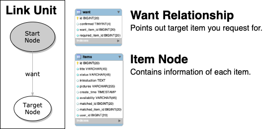
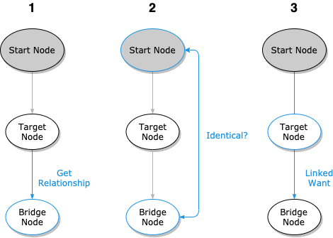
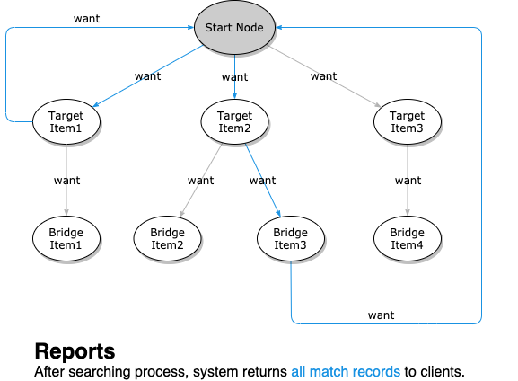
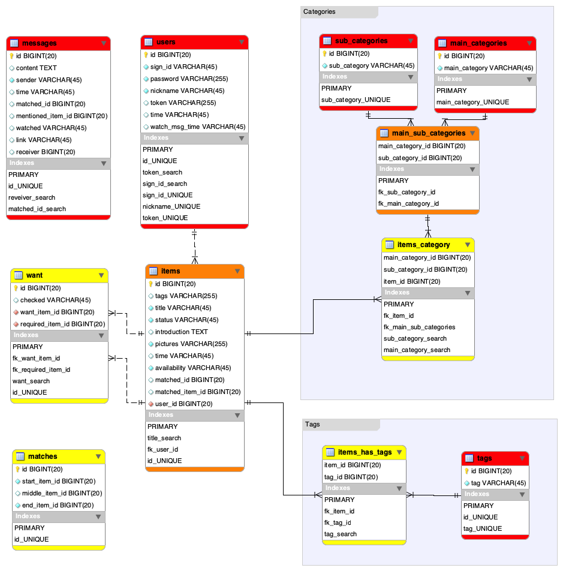
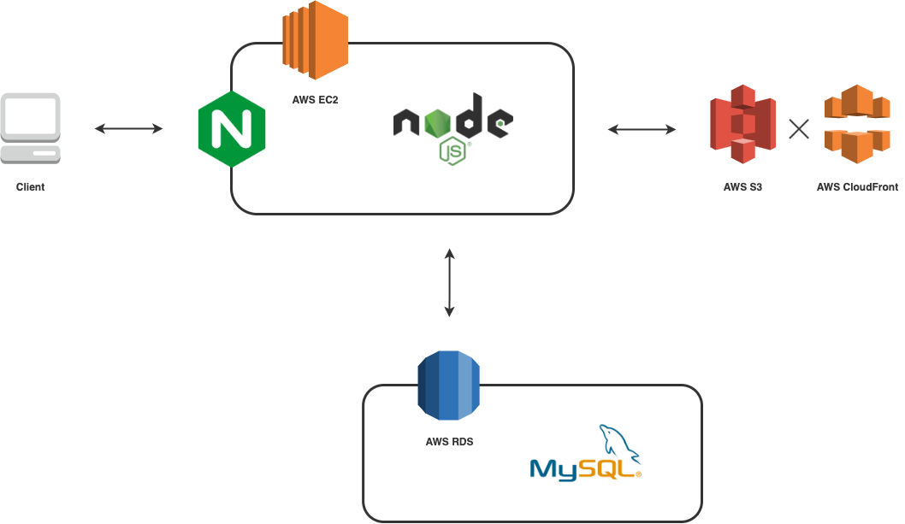
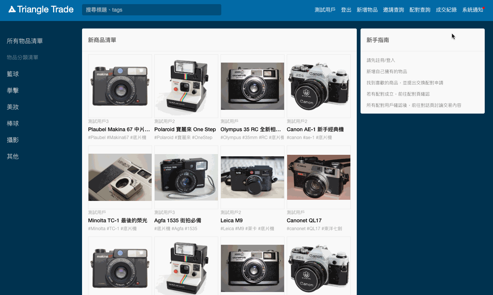
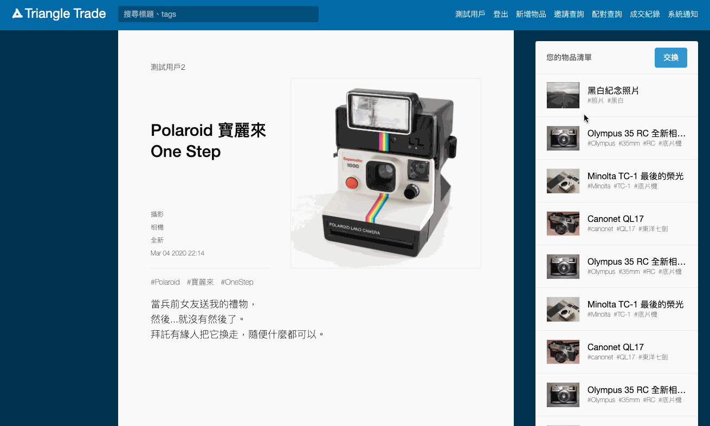
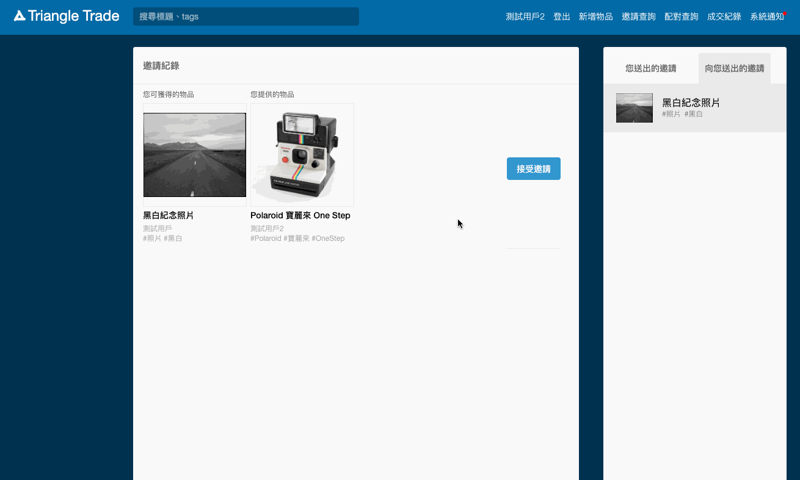
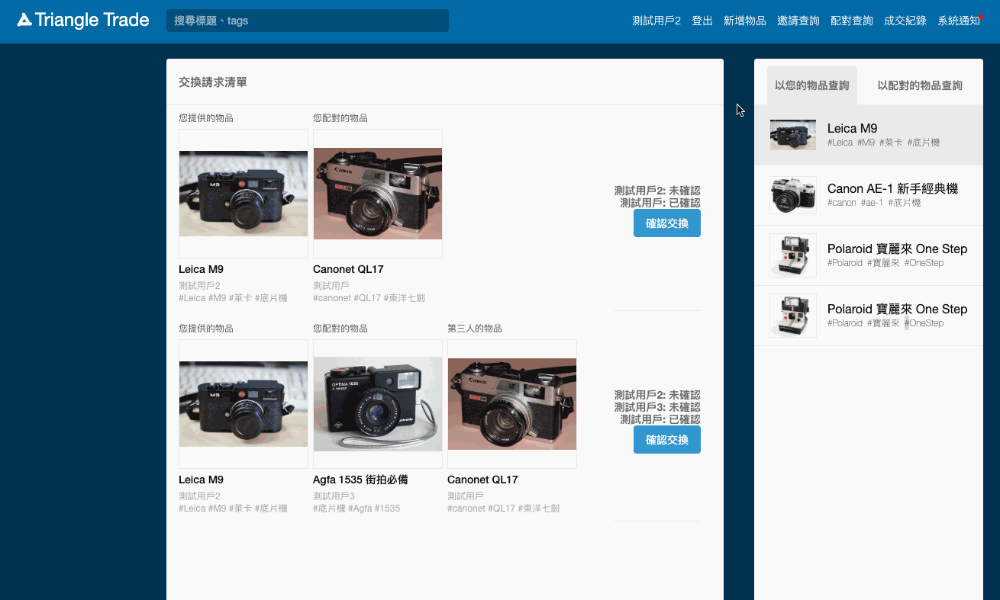
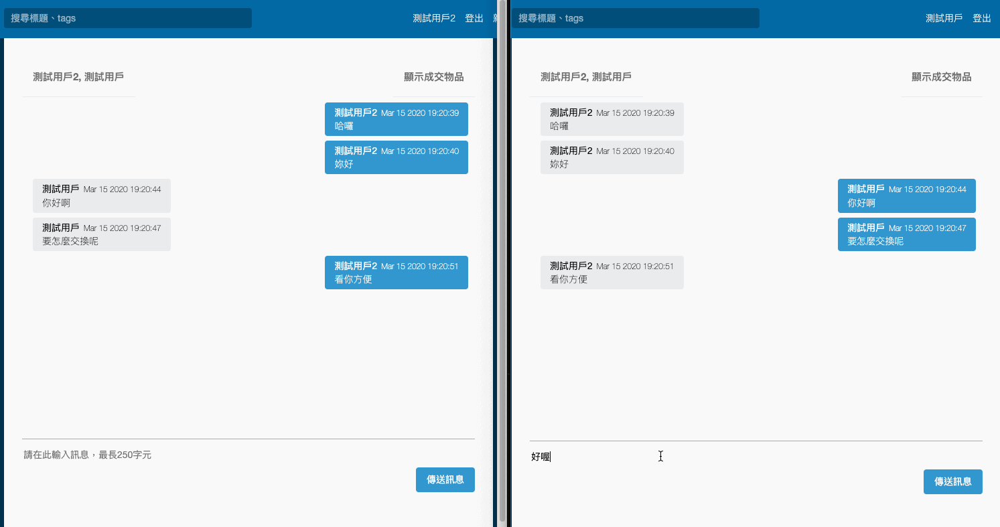

# Triangle Trade

Inspired by **breadth-first search** and **linked-list** data structure, Triangle Trade's special "triple-matching" algorithm enables users to **exchange items among three people** in real time and helps users get what they are longing for.

* Main Features
  * **Triple exchange mechanism** with auto-matching algorithm.
  * **Real-time communication** between users with Socket.IO.
  * **Active notifications** to related users by every stage of exchanging process.

* Website URL
  * https://triangletrade.jia-boung.com/

* One Minute Demonstration
  * https://youtu.be/tjqDEWMc1Kk
<iframe width="560" height="315" src="https://www.youtube.com/embed/tjqDEWMc1Kk" frameborder="0" allow="accelerometer; autoplay; encrypted-media; gyroscope; picture-in-picture" allowfullscreen></iframe>

* Test accounts
  * ID: test / test2 / test3
  * Password: 123

## Table of Contents

* [Why Triple?](#Why-Triple?)
* [How Triangle Trade Work](#How-Triangle-Trade-Work)
  * [Search](#Search)
  * [Match](#Match)
  * [Report](#Report)
* [What I have applied](#What-I-have-applied)
* [Database Schema](#Database-schema)
* [Architecture](#Architecture)
* [Contact](#Contact)

<!-- * [Manual](#manual)
  * [Browse items](#browse-items)
  * [Add items](#add-items)
  * [View item details](#view-item-details)
  * [Check notifications](#check-notifications)
* [Exchange Operations](#exchange-operations)
  * [Send invitations](#send-invitations)
  * [Match with others](#match-with-others)
  * [Confirm for trade](#confirm-for-trade) -->

## Why Triple?

Triple-matching mechanism not only means more chance than matching between two people, but **makes exchange available again** for you even if your direct exchange request was turned down by the item owner. Moreover, as time goes on, your exchange possibility will enlarge as number of potential bridging items increase.

## How Triangle Trade Work

### Search

System search through nodes by **want relationship between them.** Every item is treated as a node, and each item connects to another with want relationship.

Both request sender's item ID and request receiver's item ID will be recorded in want relationship, and system searches match of items layers by layers with these connections.

### Match

After searching for linked nodes, **system match leaf nodes with root node.** Each match requires three steps to be done :

1. Gets want based on target nodes from last match.

2. Compares the latest node with root node and records into response if they are identical.

3. Combines new want with former one to generate linked-want from root node to the latest node.

### Report

After assigned times of search, system return information of all related items with match records to clients. Meanwhile, all related users will be notified by system.

## What I have applied

* General
  * RESTful API
  * MVC design pattern
  * Functional Programming
  * SQL skills (transaction, index, foreign key)

* Backend tools
  * Node/Express
  * Socket.IO
  * Nginx
  * AWS EC2/RDS/S3
  * Multer
  * MySQL
  * NPM
  * PM2

* Front-End tools
  * Pug
  * jQuery
  * CSS & HTML

* Development tools
  * Jest
  * ESLint
  * Git/Github
  * Artillery
  * MySQLWorkbench

## Database Schema

## Architecture

<!-- ## Demonstration -->

<!-- ## Manual

### Browse items

Lastest items will appear in the middle of homepage, users can find items they are instersted in by **clicking classifications** on side bar, or **searching key words** with navigation bar.

### Add items

Users need to add new items before starting exchanging with others in "Add" page.

### View item details

Users can link to item's detail page by clicking item box.

### Check notifications

Users will received notifications once an invitation, match or trade event related to target user was triggered. Users can link to event related pages by clicking notifications.

## Exchange Operations

There are three scenarios of an exchange :
> **Invitation** : If no matches were found for a new "want", system will send an exchange invitation to the owner of target-item.  
> **Match** : Once system found an potential exchange among items, it will send match notification to all related matchers.  
> **Trade** : If all related matcher confirmed an exchange, system will generate a trade record and discontinue all items of the trade automatically.

### Send invitations

While in item detail page, users can choose at least one of their own items in side bar to generate an exchange invitation to others. In addition, Users can check their invitation history in "Invitation" page.

Receiver of invitation can match with senders by simplely clicking "Accept" button in this page.

### Match with others

Once any user send an invitation, system will automatically search for potential matches and notificate all related users if it found any.

Users can check their matches in "match" page and click "Confirm" button once they decided which is their ideal match.

### Confirm for trade

If all related matchers confirmed the match, system will discontinue all items of the match automatically and generate trade record of the match.

Users can check their trade history and discuss details of trade in "Trade" page.

 -->

## Contact

Email : ad81328@gmail.com
