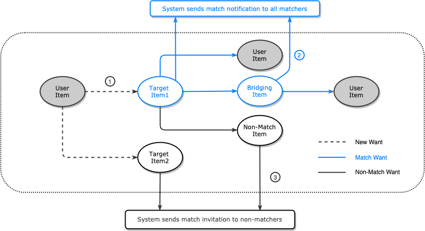

# Triangle Trade

Triangle Trade aims to provide a brand new social experience for aficionados around the world. Browse, click and chat to gather your own treasure while metting different types of new friends with same habit.

[Website URL](https://triangletrade.jia-boung.com/)

## Table of Contents

* [Technologies](#techniques)
* [Architecture](#architecture)
* [Database Schema](#database-schema)
* [Workflow](#workflow)
* [Manual](#manual)
* [Exchange Operations](#exchange-operations)

## Techniques

### Backend

* Node.js
* Express
* Nginx
* AWS EC2
* AWS S3
* Multer-S3
* AWS RDS
* MySQL
* Socket.IO
* NPM
* PM2
* Pug

### Front-End

* jQuery
* CSS & HTML

### Develop Tools

* Jest
* Trello
* EsLint
* Github
* Artillery
* MySQLWorkbench

## Architecture

## Database Schema

## Workflow

1. After an user sending "want" from its own item to others, Triangle Trade's algorithms will search for potential matches among 2-3 items.
2. If any new match found, system will send match notifications to all related matcher.
3. On the other hand, if no new matches were found, system will send match invitaion to all related non-matcher.

<!-- ## Demonstration -->

## Manual

### Browse items

Lastest items will appear in the middle of homepage, users can find items they are instersted in by **clicking classifications** on side bar, or **searching key words** with navigation bar.

### Add items

Users have to add new items before starting exchanging with others in "Add" page.

### View item details

Users can link to item's detail page by clicking item box.

### Check notifications

Users will received notifications once an invitation, match or trade event related to target user was triggered. Users can link to event related pages by clicking notifications.

## Exchange Operations

There are three scenarios of an exchange :
> **Invitation** : If no matches were found for a new "want", system will send an exchange invitation to the owner of target item.
> **Match** : Once system found an potential exchange among items, it will send match notification to all related matchers.
> **Trade** : If all related matcher confirmed an exchange, system will generate a trade record and discontinue all items of the trade automatically.

### Send invitations

While in item detail page, users can choose at least one of their own items in side bar to generate an exchange invitation to others.

Users can check their invitation history in "Invitation" page.

Receiver of invitation can match with senders by simplely clicking "Accept" button in this page.

### Match with others

Once any user send an invitation, system will automatically search for potential matches and notificate all related users if it found any.

Users can check their matches in "match" page and click "Confirm" button once they decided which is their ideal match.

### Confirm for trade

If all related matchers confirmed the match, system will discontinue all items of the match automatically and generate trade record of the match.

Users can check their trade history in "Trade" page.

## Contect

Email : ad81328@gmail.com
